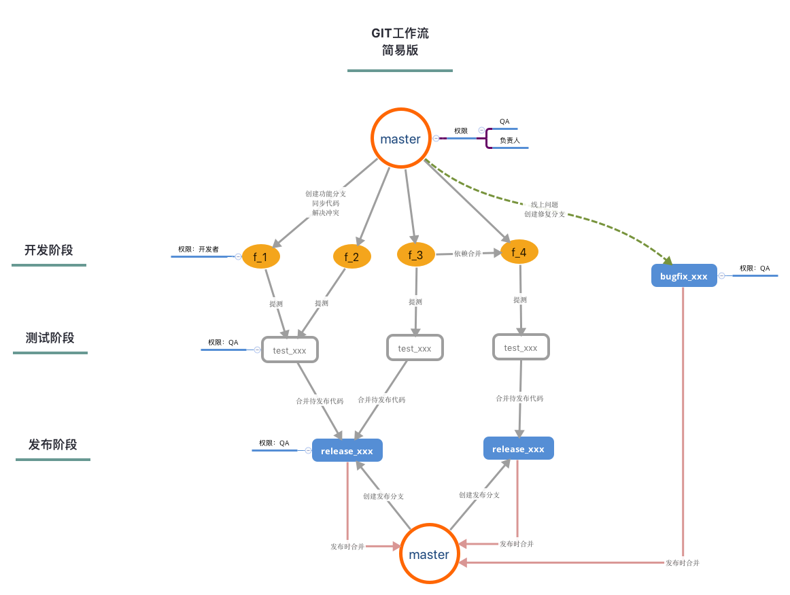

# git项目工作流程

## 前言
本工作流程基于第一版工作流程创建，并对实际使用中遇到的问题进行了处理，调整了流程中的一个重要环节，并明确了QA在整个流程控制中的主导地位。

## 流程示意图

## 基本原则

1. `master`分支仅仅接受以下两个途径的代码合并
    + 已经发布上线确认无误的 `release` 分支
    + 已经发布上线确认无误的 `bugfix` 分支
2. 禁止在 `master` 上使用上述分支合并以外的任何操作
3. 所有在线发布（含在线确认）均从 `release`/`bugfix` 发布，禁止发布其他任何分支

## 代码流程

### 开发阶段
- [开发] 基于`master`创建 `f_<描述>` 进行开发
- [开发] 在收到`master`变更通知时，同步（合并）`master`代码到功能分支
- [开发] 开发基本完毕，前后端自行联调
- [开发] 提测
    + 注明前后端的开发分支 `f_xxx`
    + 如果当前分支存在线性分支依赖，需要在提测说明中备注清楚所依赖的分支以及功能

### 测试阶段
- [QA] 基于`master`创建测试分支`test_<描述>`
- [QA] 基于`f_xxx`分支合并到相应的`test_xxx`分支
- [QA、开发] `f_xxx`合并`test_xxx`冲突时，开发在`f_xxx`处理

### 发布阶段
- [QA] 基于`master`创建发布分支`release_<描述>`
- [QA] 将验收完毕需要发布的所有`test_xxx`合并到`release_xxx`
- [QA] 将`release_xxx`发布到`预发布环境`
- [QA、开发] 到`预发布环境`进行功能以及代码验证
- [QA] 发布在线后，通知开发、产品进行线上确认

### 收尾阶段
- [QA] 发布在线并确认无误后
    1. 以`master`为参考，创建tag备份分支`master_backup_<日期或描述>`
    2. 将`release_xxx`合并到`master`分支

- [QA、开发] 清理临时分支，例如`release_xxx`，`test_xxx`，`f_xxx`。该删除操作，可以每周固定时间统一进行

### 回滚阶段
- [QA] 当发布在线后，若发现问题，评估问题风险，若风险较高，则进行回滚操作，方法有二：
    1. 利用运维发布系统的回滚操作进行回滚
    2. 从`master`新拉`release_revert`分支进行发布
- [QA] 回滚发布后进行再次确认
    - 确认无误后，结束
    - 确认有误后，必须利用 OPS 重复回滚阶段或进入bugfix阶段

### bugfix阶段
- [QA] 发现线上问题后，评估问题风险，若风险较低或不能回滚，则进入 bugfix阶段
- [开发] 基于`master`创建`bugfix_<描述>`分支
- [开发] 提交修复代码，完成并自测后，通知QA验收
- [QA] 收到开发通知后，将`bugfix_xxx`发布到在线确认进行验收
    - 若验收通过，则进入下一步
    - 若验收不通过，则通知开发再次修改
- [QA] 发送在线发布申请邮件，等待将`bugfix_xxx`发布在线
- [QA] 发布在线后，通知开发、产品进行确认
    - 确认无误后进入bugfix收尾阶段
    - 确认有误，进入回滚阶段或重复bugfix阶段

### bugfix收尾阶段
- [QA] 当在线发布确认无误后
    1. 以`master`为参考，创建tag备份分支`master_backup_<日期或描述>`
    2. 将`bugfix_xxx`合并到`master`
- [QA] 删除`bugfix_xxx`分支。该删除操作，可以每周固定时间统一进行